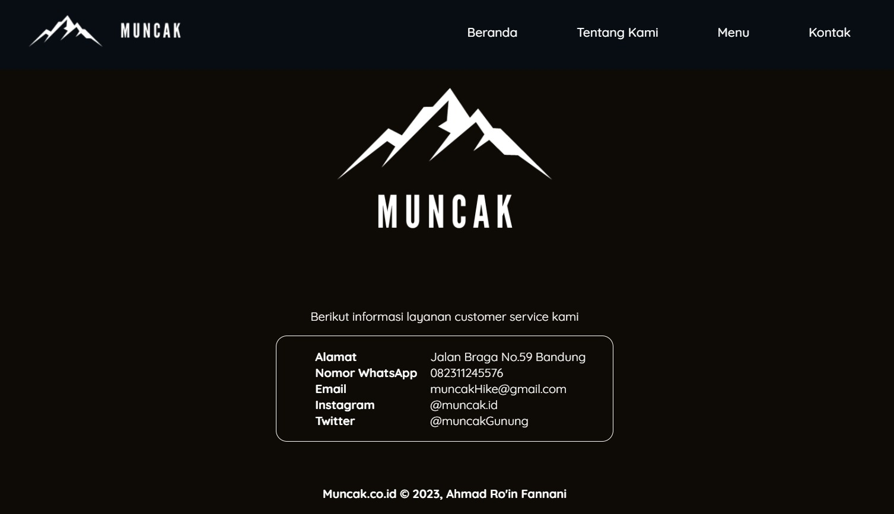
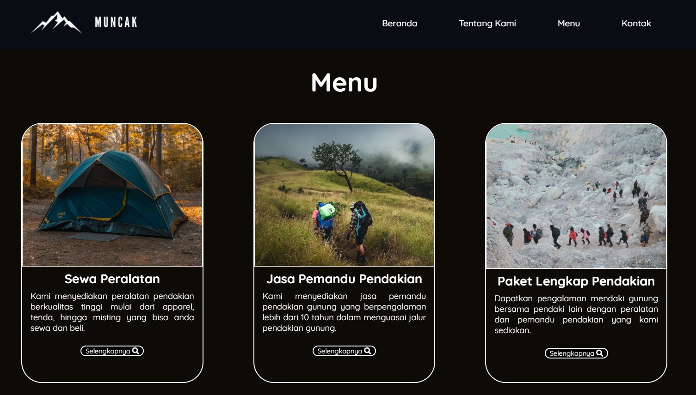

# Muncak App

This project is a static website designed to provide information about a mountain climbing equipment rental service. It is built using HTML and CSS, focusing on semantic HTML for well-organized and accessible content. The design is enhanced with CSS, applying styles for fonts, colors, and layouts to create an appealing visual experience. Additionally, responsive layout techniques like Flexbox ensure the website adapts seamlessly to different screen sizes, making it user-friendly across various devices.

# Overview

  

    
    
  

  

    
  

